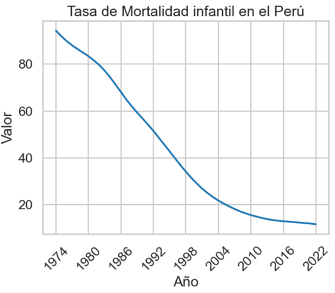
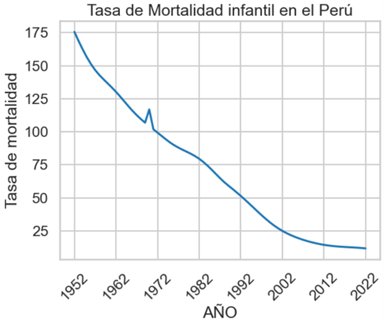
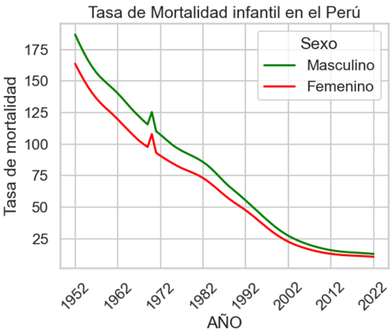
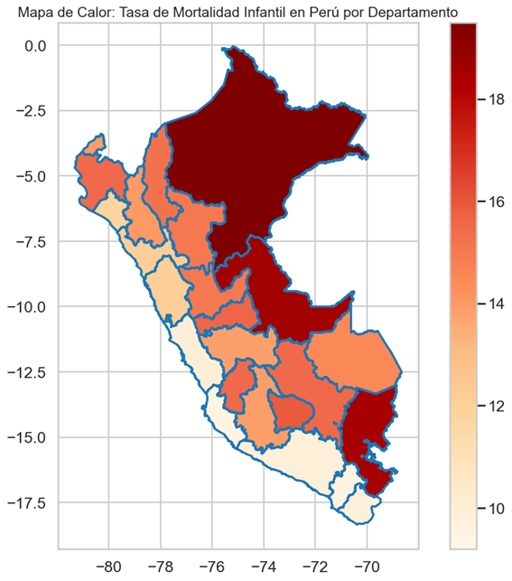
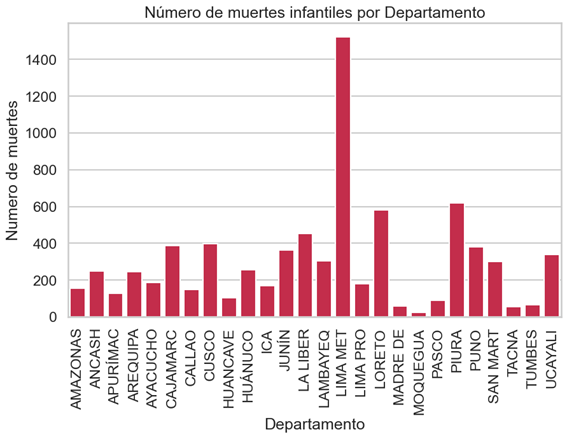
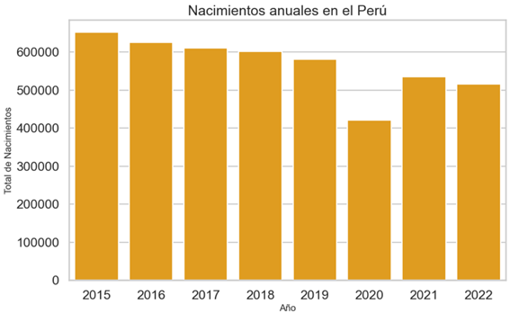
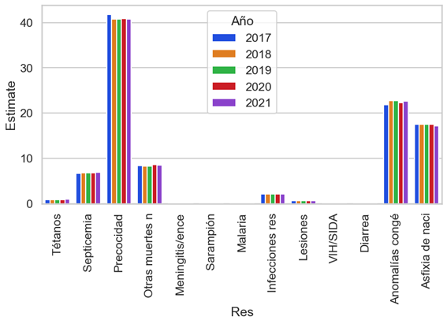

# 📊 Análisis Visual de la Mortalidad Infantil en el Perú

A continuación se presenta una interpretación detallada de cada imagen incluida en el análisis de datos sobre mortalidad infantil en el Perú. Este conjunto visual permite identificar patrones geográficos, demográficos y médicos asociados a la salud de los recién nacidos.

---

##  Imagen 1: Tasa de Mortalidad Infantil en el Perú (por cada 1000 nacidos vivos)

Se observa una **disminución sostenida** en la tasa.
Refleja avances en salud pública, cobertura de vacunación, acceso a servicios de salud y programas materno-infantiles.
Muestra el impacto positivo de políticas sanitarias implementadas desde los años 90.

---

## 🖼️ Imagen 2: Comparación de Mortalidad Infantil Masculina y Femenina

Gráfico comparativo de la tasa de mortalidad entre varones y mujeres menores de un año.

Probablemente existan a **factores biológicos** que hacen a los varones más vulnerables en la etapa neonatal, sin embargo no es existe certeza.

---

##  Imagen 3: Tasa de Mortalidad Infantil por Departamento (Mapa de Calor)

Mapa del Perú coloreado por intensidad de mortalidad infantil por región.
Regiones como **Loreto, Ucayali y Puno** presentan las tasas más altas.
Denota **desigualdades regionales** y deficiencias en el acceso a salud en zonas amazónicas y altoandinas.

---

## 🖼️ Imagen 4: Número de Muertes Infantiles por Departamento

Gráfico de barras por cantidad total de muertes infantiles según departamento.

**Lima Metropolitana** lidera por volumen absoluto debido a su **mayor población**.
Sin embargo, regiones con menos población pero con muchas muertes (ej. Loreto) reflejan situaciones críticas en salud pública.

---

##  Imagen 5: Evolución de Nacimientos Anuales en el Perú

Existe una **tendencia descendente** en nacimientos.
- Relacionado con:
  - Cambios culturales y económicos.
  - Menor tamaño promedio de familias.

---

##  Imagen 6: Causas Principales de Mortalidad Infantil (2017–2021)

Gráfico de barras o categorías que agrupa las principales causas médicas de muerte infantil.

- La **prematuridad** es la causa más común cada año, por lo que se deberían impulsar políticas públicas para asistencia médica especializada en estos casos.
- Le siguen **anomalías congénitas** y **asfixia perinatal** .

---

> Estos gráficos permiten comprender visualmente la situación actual de la mortalidad infantil en el Perú y dan soporte a decisiones basadas en datos para mejorar la salud neonatal, especialmente en regiones vulnerables.

